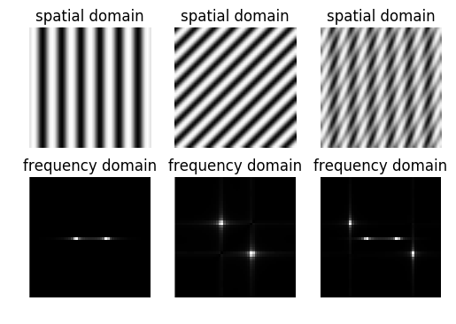

# Image Processing and Computer Vision

The following notebook implements and demonstrates many of the key concepts, methods and algorithms in the University of Bristol Image Processing and Computer Vision course. The notebook covers the following topics:
* Image Acquisition and Representation
    * Modelling Images
    * Sampling
    * Convolutions
* Frequency Domain and Image Transforms
    * Fourier Analysis
    * Fourier Transforms
    * Convolution Theorem
    * Hough Transforms
* Object Detection
    * Integral Images
    * Harr-Like Features
    * Ada-Boosting
* Detecting Motion
    * Optical Flow Equations
    * Lucas-Kanade Method
* Stereo Vision
    * Epipolar Geometry
    * Scale-Invariant Feature Transform (SIFT)
    * Spatial Gradient Descriptors


```python
from __future__ import division
from itertools import product, ifilter, izip, imap, chain, starmap, combinations
from functools import partial
from operator import getitem, mul, sub
from random import sample, seed
from collections import Counter
from math import factorial as fac, cos, sin
from time import sleep
import sys
print sys.version

import cv2
import numpy as np
import scipy as sp
import matplotlib.pyplot as plt
%matplotlib inline

from IPython.display import clear_output
from collections import Counter
from scipy.cluster.hierarchy import dendrogram, linkage

# helper functions

def indices( image ):
    return product(*map( range, image.shape ))

def load_image( name ):
    image = cv2.imread( 'images/%s' % name, cv2.IMREAD_COLOR )
    return cv2.cvtColor( image, cv2.COLOR_BGR2RGB )

def show_image( image, ax = None, **kwargs ):
    ''' Given a matrix representing an image, (and optionally an axes to draw on), 
        matplotlib is used to present the image inline in the notebook.
    '''
    if ax == None:
        fig, ax = plt.subplots()
        ax.imshow( image, cmap = 'Greys_r', **kwargs )
        ax.axis( 'off' )
    else:
        ax.imshow( image, cmap = 'Greys_r', **kwargs )
        ax.axis( 'off' )
    return ax
        
def ideal_grid_size( n ):
    bound = 1 + int( np.ceil( np.sqrt( n ) ) )
    size = ( 1, n )
    for i in range( 1, bound ):
        if not n % i:
            j = n // i
            size = ( i, j )
    return size
    
def show_images( images, titles = [], orientation = 'horizontal', 
                figsize=(32, 32), structure = [] ):
    
    if not structure:
        l = len( images )
        if orientation == 'vertical':
            ncols, nrows = ideal_grid_size( l )
        else:
            nrows, ncols = ideal_grid_size( l )
            
        structure = [ ncols ] * nrows    
        
    for n in structure:
        fig = plt.figure( figsize = figsize )
        for plotnum in range( 1, n + 1 ):
            ax = fig.add_subplot( 1, n, plotnum )
            if titles:
                ax.set_title( titles.pop(0) )
            plotnum += 1
            ax.axis( 'off' )
            ax.imshow( images.pop(0), cmap='Greys_r' )
        plt.show()
        
def to_255( img ):
    out = img - np.min( img )
    return out * 255 / np.max(out)
```

    2.7.12 |Anaconda custom (64-bit)| (default, Jun 29 2016, 11:07:13) [MSC v.1500 64 bit (AMD64)]
    

# Image Aquistion and Representation

## Modelling Images

An image is modelled by a quantized function mapping a coordinate space to a colour space, an image $f : X^n \rightarrow C^m$ maps $n$-dimensional vectors in an input space to $m$ colour values. For example a single RGB-colour image of shape $w, h \in \mathbb{N}$ is modeled where

\begin{align*}
    X^n &= \{0 \leq x < w\ |\ x \in \mathbb{N}\} \times \{0 \leq x < h\ |\ x \in \mathbb{N}\} \\
    C^n &= \{0 \leq x < 255\ |\ x \in \mathbb{N}\}^3 \\
\end{align*}

This relationship is typically encoded using three matrices - one for each colour channel.

## Sampling

When a signal is captured or a function is computed and stored on a computer, there is a specific finite density in which the information can be kept at. While the function $f(x) = sin(x)$ describes an infinite number of infinitely close pairs of real numbers, we can only compute a finite number of these pairs. Sampling is the number of instances stored or computed per unit distance of the domain. The following computes the function $f(x) = sin(2\pi\cdot3x) + cos(2\pi x)$ across the interval $[-\pi, \pi]$ with increased sampling, where the top-leftmost plot samples 1 $y$-values along each unit of the $x$-axis and the bottom-rightmost plot samples 6. In each plot the green curve is the actual function, the red dots are samples and the blue curve is the resultant approximation to $f$


```python
fig, axs = plt.subplots(2, 3, figsize = (20, 10))
for i, ax in enumerate(axs.flatten()):
    xs = np.arange( -np.pi, np.pi, 1 / (i+1) )
    ys = np.sin(2*np.pi*3*xs) + np.cos(2*np.pi*xs)
    ax.plot( xs, ys )
    ax.set_xlim([ -1, 1 ])
    ax.set_ylim([ -2, 2 ])
    ax.scatter( xs, ys, color='red' )
    xs = np.arange( -np.pi, np.pi, 0.01 )
    ys = np.sin(2*np.pi*3*xs) + np.cos(2*np.pi*xs)
    ax.plot( xs, ys )
    ax.set_title( '%i samples per unit' % (i+1) )
plt.show()
```


### Shannon's Sampling Theorem

An analogue signal containing components up to some maximum frequency $u$ may be completely reconstructed by regularly spread samples, provided the sampling rate is above $2u$ samples per second. This is demonstrated by the example above, the function $f$ is a linear combination of two components with frequencies 1 and 3, we can see that compared to the actual function the approximations from the sampling don't contain enough structure to describe the full signal until 6 samples per unit.

## Convolutions

We can filter symbols and signals in the spatial/time domain to introduce some form of enhancement to the
data and prepare it for further processing or feature selection. Many spatial filters are implemented with
covolution masks. If $f$ is the signal, $h$ is the covolution filter and the discrete form of the convolution is
defined,

$$
    g(x) = \sum_{i = -n}^{n}{f(x-i)h(i)}
$$

It is extended into multiple dimensions in the obvious way, and is written in shorthand as $g = f*h$.


## Fourier Analysis

The core principle of Fourier series is that the set of real periodic functions can be constructed as a Hilbert space of
infinite dimensions with sine and cosine functions of different frequencies forming the basis vectors. More specifically,
considering any real valued function $f : \mathbb{R} \rightarrow \mathbb{R}$ where for some $T$ and all $x$, 
$f(x) = f(x+T)$, Fourier analysis says that for $f$, there exists sequences of coefficients
over the reals, $\langle a_n \rangle$ and $\langle b_n \rangle$ known as the Fourier coefficients such that,

$$
    f(x) = \sum_{n=0}^{\infty}{a_n \cos\Big(\frac{2\pi n x}{T}\Big) + b_n \sin\Big(\frac{2\pi n x}{T}\Big)}
$$

As sin(0) = 0 and cos(0) = 1, this is often written as,

$$
    f(x) = a_0 + \sum_{n=1}^{\infty}{a_n \cos\Big(\frac{2\pi n x}{T}\Big) + b_n \sin\Big(\frac{2\pi n x}{T}\Big)}
$$

This allows any arbitrary periodic function to be broken into a set of simple terms that can be solved individually, 
and then combined to obtain the solution to the original problem or an approximation to it.

As mentioned previously, the functions are elements of a vector space with different frequencies of cosine and
sine functions forming the basis vectors. This fact allows us to understand how we can compute the Fourier 
coefficients. Consider a more general $n$ dimensional vector space $V$ with orthonormal basis vectors 
$B = \{ \mathbf{e}_i : 0 \leq i < n\}$, and orthogonality defined through
the inner product (dot product) such that two vectors $\mathbf{v, w}$ are orthogonal if and only if 
$\mathbf{v} \cdot \mathbf{w} = 0$. Hence for any $\mathbf{v} \in V$ we can write,

$$
    \mathbf{v} = \sum_{i = 0}^{n}{c_i \mathbf{e}_i}
$$

for coefficients $\langle c_i \rangle$. To compute an individual coefficient $c_j$, we use the fact that all the basis 
vectors are orthonormal to say for $i \neq j, \mathbf{e}_i \cdot \mathbf{e}_j = 0$ and 
$\mathbf{e}_j \cdot \mathbf{e}_j = 1$, leading to,

$$
    c_j = \mathbf{v} \cdot \mathbf{e}_j 
$$

Going back to our more specific case for Fourier analysis, for functions $f, g$ in the vector space of periodic
functions we define the inner product to be

$$
    f \cdot g =\frac{1}{T} \int_{0}^{2 T}{f(x) g(x) dx}
$$

We choose the limits as such and divide by $T$ to get the desired properties from the inner product, these
are highlighted  by considering general elements of the basis set $\cos nx, \cos mx, \sin nx, \sin mx$ such that
$m \neq n$,

\begin{align*}
    \cos nx \cdot \cos mx &= \frac{1}{\pi}  \int_0^{2\pi}{ \cos nx \cos mx dx} = 0 \\
    \cos nx \cdot \sin mx &= \frac{1}{\pi}  \int_0^{2\pi}{ \cos nx \sin mx dx} = 0 \\
    \sin nx \cdot \sin mx &= \frac{1}{\pi}  \int_0^{2\pi}{ \sin nx \sin mx dx} = 0 \\
    \cos nx \cdot \cos nx &= \frac{1}{\pi}  \int_0^{2\pi}{ \cos nx \cos nx dx} = 1 \\
    \sin nx \cdot \sin nx &= \frac{1}{\pi}  \int_0^{2\pi}{ \sin nx \sin nx dx} = 1
\end{align*}

So applying these identities to the case of $f(x)$, with the same reasoning that got us the coefficients in the 
general vector space case we can find the Fourier coefficients by taking the inner product with the basis functions 

\begin{align*}
    a_n &= \int_{-\frac{T}{2}}^{\frac{T}{2}}{ f(x) \cos\Big( \frac{2\pi n x}{T}\Big) dx } \\
    b_n &= \int_{-\frac{T}{2}}^{\frac{T}{2}}{ f(x) \sin\Big( \frac{2\pi n x}{T}\Big) dx }
\end{align*}

For the function $s(x) = x / \pi$ for $-\pi \leq x \pi$ and $s(x) = s(x \mod 2\pi - pi)$ otherwise, the following cells shows the Fourier approximation for increasingly higher order terms, where
$$
    s_n(x) = \sum_{n=1}^{N}{\frac{1}{n} (-1)^{n+1} \sin nx}
$$
Running the cell animates the plot and shows how the approximation improves with more terms.


```python
for N in range(1, 10) + range(10, 100, 5) + range(100, 1001, 100):
    fig, ax = plt.subplots()
    s = lambda x : (((x-np.pi)%(2*np.pi))/np.pi) - 1
    xs = np.linspace( -10, 10, num = 1000 )
    ys = map( s, xs )
    ax.plot( xs, ys, label='original function' )
    s_n = lambda x : sum( ((-1)**(n+1)) * sin(n*x) / n for n in range(1, N+1) ) * 2 / np.pi
    ys = map( s_n, xs )
    ax.plot( xs, ys, c = 'r', label='approximation' )
    ax.set_title( 'Fourier Approximation of %d terms' % N )
    ax.set_xlim( -3*np.pi, 3*np.pi )
    ax.set_ylim( -1.5, 2.5 )
    ax.legend()
    plt.show()
    clear_output( wait = True )
    sleep( 0.2 )
```


### Fourier Transforms

The motivation behind Fourier transforms is to produce a function $F$ that describes the frequencies in some
other function $f$. We call the domain of $f$ the time domain and the domain of $F$ the frequency domain, this
is simply because this is usually applied to problems involving signals. The idea is that if we chose some frequency $u$, the value $F(u)$ is how

Formally defined, the Fourier transform $F$ of a univariate continuous function $f$ is defined as,

$$
    F(u) = \int_{-\infty}^{\infty}{f(x) e^{-2\pi uxi} dx}
$$

where $i$ is the imaginary number $i^2 = -1$. This is discretized by assuming $0 \leq x \in \mathbb{N} < n$
and replacing the integral with a sum,

$$
    F(u) = \frac{1}{n} \sum_{x=0}^{n-1}{f(x) e^{-(2\pi ux/n)i} }
$$

The concept of the frequency domain follows from Euler's Formula for $e^{-i\theta}$, whereby each term
of the Fourier transform is composed of the sum of *all* values of the function $f$ multiplied be
the sines and cosines of various frequencies. In this context we say that we've transformed from a time
domain to a frequency domain representation.

An image quantized to $c$ channels with discrete a width and height has a Fourier transform of the same width and height but with $2c$ channels. This is because each $u, v, c$ coordinate in the transform maps to a complex number, which is in turn described by two numbers. Consider the case of a grayscale image, the Fourier transform is essentially two images corresponding to the phase $\theta$ and magnitude $r$ in each complex number $F(u, v) = r e^{i \theta}$ 


```python
xlim, ylim = ( -np.pi, np.pi ), ( -np.pi, np.pi )
imsize = 50
x, y = np.meshgrid( np.linspace(*xlim, num=imsize), 
                    np.linspace(*ylim, num=imsize) )

functions = [
    np.cos(2*np.pi*x),
    np.sin(2*np.pi*(x + y)),
    np.cos(2*np.pi*x) + np.sin(2*np.pi*(2*x + y))
]

fig, axs = plt.subplots( 2, len(functions) )
top, bottom = axs[0], axs[1]
for ax1, ax2, f in zip( top, bottom, functions ):
    show_image( f, ax1 )
    z = np.fft.fft2(f)
    q = np.fft.fftshift(z)
    mag = np.absolute(q)
    show_image( mag, ax2, interpolation = 'none' )
    
    ax1.set_title('spatial domain')
    ax2.set_title('frequency domain')
plt.show()
```





```python
lena = load_image( 'lena.bmp' )
image = cv2.cvtColor( lena, cv2.COLOR_RGB2GRAY )
f = np.float32( image )
z = np.fft.fft2(f)
q = np.fft.fftshift(z)
mag = np.absolute(q)
ang = np.angle(q)
a = np.real(q)
b = np.imag(q)

titles = [ 'input image', 
           'magnitude spectrum', 
           'phase spectrum' ] 
images = [ image, 
           np.log(1 + mag), 
           ang ]

fig, axs = plt.subplots( 1, 3, figsize=(9, 3) )
for ax, image, title in zip( axs, images, titles ):
    show_image( image, ax )
    ax.set_title( title )
plt.show()
```


### Frequency Domain Analysis

A simple example is to consider speech recognition between two utterances $x(t)$ and $y(t)$. A naive approach
would be to apply some least-squares like model with $E=\sum_t (x(t) - y(t))^2$, where $E$ measures the distance
a distance between the utterances. However the problems with these approaches is they don't account for the
kinds of transformations we want speech recognition to pick up on, such as $x(t) = y(x+c_1)$ or $x(t) = c_2y(t)$ for
arbitrary constants $c_1, c_2$.

To solve this we take the Fourier transforms for both utterances to get $X(u)$ and $Y(u)$, and then we consider
the Euclidean distance between their magnitude spectrums $|X(u)|$ and $|Y(u)|$.


### Spatial Frequency

Fourier transforms in higher dimensions follow quite naturally from the one dimensional case,
$$
    F(u, v) = \int_{-\infty}^{\infty} \int_{-\infty}^{\infty}{f(x, y)\ e^{-2\pi i(ux + vy)} dxdy}
$$
For example images are functions of two variables, and hence can be defined in terms of a *spatial frequency*.
The Fourier transform characterises the rate of change of intensity along each dimension for an image. Most of the
concepts from one dimension follow quite straight forwardly into two dimensions, such as transformations between time and frequency domains.

## Fast Fourier Transform

### Intuition and Motivation

Fast Fourier transforms are used to multiply polynomials with $O(n\log n)$ time complexity. A degree $n$
polynomial can be seen as a function
$$
f(x) = \sum_{i=0}^{n-1}{a_i x^i}
$$

In order to multiply polynomials, we first need to represent them. Intuitively the most natural representation is
simply a sequence of the coefficients, $\langle a_0, a_1, a_2, \dots , a_{n-1} \rangle$, where an elements
position in the sequence is the magnitude of the exponent the variable is raised to for which the coefficient is multiplied
by in the polynomial. This representation is called ***coefficient representation***. 

With coefficient representation, polynomial multiplication can be computed with time complexity $O(n^2)$. To reduce 
this we need to find a better representation of polynomials, to do so consider the following fact, 

*Given $n$ points $(x_i, y_i)$, with all distinct $x_i$, there is a unique polynomial $f(x)$ of degree-bound $n-1$ such that $y_k = f(x_k),\ \forall\ 0 \leq k < n$.*

This means for a polynomial $f(x)$ of degree $n-1$ we can maintain a set of $n$ points $(x_i, f(x_i))$ to uniquely 
describe $f(x)$ in the space of functions $\mathbb{C} \rightarrow \mathbb{C}$ of degree $n-1$. This representation
is refered to as ***point-value representation***. 

With point-value representation, in order to do arithmetic its important that both the references use the
same evaulations points. If this holds for two polynomials of degree $n-1$, $f(x)$ and $h(x)$, then the
product $f(n)h(n)$ is represented in point-value form as,
$$
\{(x_0, f(x_0)h(x_0)), (x_1, f(x_1)h(x_1)), \dots , (x_{n-1}, f(x_{n-1})h(x_{n-1})) \}
$$
This shows that polynomials represented in point-value form can have their products multiplied with $O(n)$ time
complexity. This then leads to the crux of what fast Fourier transform is about; transforming polynomials
from coefficient representation to point-value representation.

To transform a polynomial of degree $n$ to point-value representation, we need to evaluate it a $n$ different points.
Naively this appears to neccessarily have a time complexity $O(n^2)$, however the idea is to choose points such
that we can ensure a symmetry that leads to various values being the same as one another, and hence don't have
to be calculated multiple times.

To do this we consider the ***N-th complex roots of unity***, given some $N$, we will use $\omega_N$ 
to denote the first complex root of unity. The properties of these numbers lead naturally to the set of them being
represented as $w_N, w_N^2,\dots, w_N^{N-1}$. To explain why we are using this points, consider the 
following properties:

### The Cancellation Lemma: 
$$
\forall\ d,k \in \mathbb{N},\ \omega_{dN}^{dk} = \omega_N^k
$$

### The Halving Lemma:

If $N>0$ is even then the squares of the $N$ complex $N$-th roots are the $\frac{N}{2}$ complex 
$\frac{N}{2}$-th roots of unity. Which is to say for all even nonnegative $N$ and nonnegative $k$,
$$
(\omega_N^k)^2 = \omega_{\frac{N}{2}}^k
$$

### Algorithm

It follows from the halving lemma that if we square all the $n$-th roots of unity, then each $\frac{n}{2}$-th root
of unity is obtained exactly twice, this hence justifies using the roots of unity as points to represent our polynomial
as we can use this property to reduce the number of operations in the computation.

So we want to evaluate a polynomial $f(x)$ at the $n$ roots of unity. Therefore for every $0 \leq k < n$, we evaluate
$$
f(\omega_n^k) = \sum_{j=0}^{n-1}{a_j(\omega_n^k)^j}
$$
Let's define the vector of results for these evaluations as $y_k = f(\omega_n^k)$, this vector $y=(y_0,\dots,y_{n-1})$
is the ***Discrete Fourier Transform (DFT)*** of the coefficient vector $a=(a_0,\dots,a_{n-1})$. Using 
the halving lemma and our conclusions from it, we can recursively divide an $n$-element DFT computation into two
$\frac{n}{2}$-element DFT computations and combine the results in linear time. So for some polynomial $f(x)$, let
\begin{align*}
f_1(x) &= a_0 + a_2x + \dots + a_{n-2}x^{\frac{n}{2}-1} \\
f_2(x) &= a_1 + a_3x + \dots + a_{n-1}x^{\frac{n}{2}-1}
\end{align*}
such that $f_1(x)$ and $f_2(x)$ are related to $f(x)$ as such,
$$
f(x) = f_1(x^2) + x f_2(x^2)
$$
Now, evaluating $\omega_n^k$ is broken down,
\begin{align*}
f(\omega_ n^k) &= f_1((\omega_ n^k)^2) + \omega_ n^k f_2((\omega_ n^k)^2) \\
&= f_1(\omega_ {\frac{n}{2}}^k) + \omega_ n^k f_2(\omega_ {\frac{n}{2}}^k)
\end{align*}

This quite neatly outlines the recursive process used to compute the Fourier transform from coefficient form to
point-value form. As for the time complexity, to evaluate any given complex root of unity the problem is split into
exactly 2 subproblems of the same nature as the overall problem so it evidently has time complexity $\log n$. This
process has to occur exactly $n$ times for each complex root, hence the transform has time complexity $O(n \log n)$.

As the FFT is a transformation from one representation to another, it naturally follows to think about the inverse
transformation, that is from point-value representation to coefficient representation. To compute the inverse FFT
with the same time complexity we use the following relationship,
$$
a_i = \frac{1}{n} \sum_{j=0}^{n-1}{y_i \omega_n^{-ji}}
$$
which from the FFT, switches the roles of $a$ and $y$, replaces $\omega_n$ with $\omega_n^{-1}$ and divides the
final result by $n$.

# Filtering

### Convolution Theorem

Convolution in the spatial domain is equivalent to multiplication in the frequency domain (and vice versa).

\begin{align*}
    g = f*h &\implies G = FH \\
    g = fh &\implies G = F*H	
\end{align*}

This derived as follows,
\begin{align*}
    h(x) &= f(x) * g(x) = \sum_{y} f(x-y)g(y) \\
    H(u) &= \sum_x \Big( h(x) e^{-2\pi iux / N} \Big) \\
         &= \sum_x \Big( e^{-2\pi iux / N} \Big( \sum_{y} f(x-y)g(y) \Big) \Big) \\
         &= \sum_y \Big( g(y) \sum_x \Big( f(x-y) e^{-2\pi iux / N} \Big) \Big) \\
         &= \sum_y \Big( g(y) e^{-2\pi iuy / N}  \sum_x \Big( f(x-y) e^{-2\pi iu(x-y) / N} \Big) \Big) \\
         &= F(u) \sum_y \Big( g(y) e^{-2\pi iuy / N} \Big) \\
         &= F(u) G(u) \\
\end{align*}

Therefore using the Convolution Theorem in conjunction with the Fast-Fourier Transform the process of computing image responses to convolutions can be accelerated. The accelerated process has time complexity $O(n\log n)$ and the naive approach $O(mn)$, where $n$ is the size of the image and $m$ is the size of the kernel. However the slight caveat is the sizes of the hidden constants obscured by the big-oh notation, the accelerated process looks like more like $O(n \log n) = O(2n\log n + m \log m + n)$ as compared to $O(mn) = O((n-m)m) = O(mn - m^2)$.


### The Laplacian Filter

The kernel for the Laplacian filter is
$$
    k = \begin{bmatrix}
        0 & 1  & 0  \\
        1 & -4 & 1 \\
        0 & 1  & 0  \\
    \end{bmatrix}
$$


```python
def laplace( img ):
    img = np.float32( img )
    kernel = np.matrix('0 1 0; 1 -4 1; 0 1 0')
    return cv2.filter2D( img, -1, kernel )

def sharpen( img ):
    return img - laplace( img )
    
img = load_image( 'lena.bmp' )
img = cv2.cvtColor( img, cv2.COLOR_BGR2GRAY )
show_images([ img, laplace( img ), sharpen( img )], 
            ['image', 'image*k', 'sharpened'], 
            figsize = (12, 10))

# fig, axs = plt.subplots( 1, 2, figsize=(15, 5) )
# axs[0].hist( img.flatten(), 255, linewidth=0 )
# axs[1].hist( to_255(sharpen(img)).flatten(), 255, linewidth=0 )
# plt.tight_layout()
# plt.show()
```


## Gradient Approximation Kernels

### Roberts Operator

This is the oldest gradient approximation kernel and is derived directly from the formulation that calculus uses to derive the differentiation operator.

$$
    \nabla f = | f(i, j) - f(i+1, j+1) | + | f(i, j+1) - f(i+1, j)| \\
    \therefore k_1 = \begin{bmatrix} 1 & 0 \\ 0 & -1 \end{bmatrix} 
    \hspace{0.5cm} \text{and} \hspace{0.5cm}
    k_2 = \begin{bmatrix} 0 & 1 \\ -1 & 0 \end{bmatrix}
$$

Where $k_1$ and $k_2$ compute approximations to the partial derivatives of the image in the $x$ and $y$ axis'.

### Prewitt Operator

The Prewitt operator uses the assumption $\frac{\partial f}{\partial x} \approx \frac{f(x+1) - f(x-1)}{2}$ to compute the gradients. However this approach alone is very sensitive to noise so the final operator considers more of the surrounding points.

$$
    k_1 = \begin{bmatrix} 1 & 1 & 1 \\ 0 & 0 & 0 \\ -1 & -1 & -1 \end{bmatrix} 
    \hspace{0.5cm} \text{and} \hspace{0.5cm}
    k_2 = \begin{bmatrix} -1 & 0 & 1 \\ -1 & 0 & 1 \\ -1 & 0 & 1 \end{bmatrix} 
$$

### Sobel Operator

Finally, the sobel operator improves on the Prewitt operator by assigning increased weight to pixels that are closer to the central pixel, i.e.,

$$
    k_1 = \begin{bmatrix} 1 & 2 & 1 \\ 0 & 0 & 0 \\ -1 & -2 & -1 \end{bmatrix} 
    \hspace{0.5cm} \text{and} \hspace{0.5cm}
    k_2 = \begin{bmatrix} -1 & 0 & 1 \\ -2 & 0 & 2 \\ -1 & 0 & 1 \end{bmatrix} 
$$


```python
def sobel( img ):
    if len( img.shape ) == 3:
        img = cv2.cvtColor( img, cv2.COLOR_BGR2GRAY )
    gray = np.float32( img )
    dfdx = cv2.filter2D( gray, -1, np.matrix( '-1 0 1;-2 0 2;-1 0 1' ) )
    dfdy = cv2.filter2D( gray, -1, np.matrix( '-1 -2 -1;0 0 0;1 2 1' ) )
    mag = np.hypot( dfdx, dfdy )
    psi = np.arctan2( dfdy, dfdx )
    return dfdx, dfdy, mag, psi
```


```python
show_images( map( to_255, list(sobel(lena)) ), figsize = (7, 7), \
             titles = [ 'df/dx', 'df/dy', 'Magnitude Image', 'Gradient Image' ] )
```


```python
def gradient_vectors( image ):
    dfdx, dfdy, mag, ang = sobel( image )
    U = mag * np.cos( ang )
    V = mag * np.sin( ang )
    return U, V

def edge_vectors( image ):
    dfdx, dfdy, mag, ang = sobel( image )
    U = mag * np.cos( ang - np.pi / 2 )
    V = mag * np.sin( ang - np.pi / 2 )
    return U, V
    
def show_vectors_in_windows( U, V, image ):
    x, y, w, h = 90, 150, 8, 8

    U_win = U[ y:y+h, x:x+w ]
    V_win = V[ y:y+h, x:x+w ]

    win = image[ y:y+h, x:x+w ]

    fig = plt.figure( figsize = (10, 10) )

    ax = fig.add_subplot( 132 )
    ax.set_title( 'Green window' )
    show_image( win, ax, interpolation = 'none' )
    ax.quiver( U_win, V_win, angles='xy' )

    image_show_win = image.copy()
    image_show_win = cv2.rectangle( image_show_win, (x, y), (x+w, y+h), (0, 255, 0), 2 )

    x, y, w, h = 260, 260, 16, 16

    U_win = U[ y:y+h, x:x+w ]
    V_win = V[ y:y+h, x:x+w ]

    win = image[ y:y+h, x:x+w ]

    ax = fig.add_subplot( 133 )
    ax.set_title( 'Red window' )
    show_image( win, ax, interpolation = 'none' )
    ax.quiver( U_win, V_win, angles='xy' )
    lena_show_win = cv2.rectangle( image_show_win, (x, y), (x+w, y+h), (255, 0, 0), 2 )

    ax = fig.add_subplot( 131 )
    ax.set_title( 'lena.bmp' )
    show_image( image_show_win, ax )

    plt.show()
```

## Image Gradient Vectors


```python
U, V = gradient_vectors( lena )
show_vectors_in_windows( U, V, lena )
```


## Image Edge Vectors


```python
U, V = edge_vectors( lena )
show_vectors_in_windows( U, V, lena )
```


# Hough Transforms

Given an image $\underset{m \times n}{I}$ and a shape described by $p$ parameters, the Hough transform $H$ is a $p$-dimensional space that maps every possible instance of the given shape to a value indicating its presence in $I$. A caveat here is that within an image there are exponentially many incarnations of a shape that could be present, to counter this the transform is provided with a resolution to search the parameter space with. That is, for each parameter an interval and step value is provide to discretization and control the run-time of the algorithm. This resolution then describes the size of the outputted transform, and it provides the mapping between elements in the transform and the parameters of the shape they represent. Another factor in searching for possible shape incarnations is the nature of the shape itself, more specifically the solvability of the system of equations used to describe the shape.

The process of detecting shapes in images using Hough transforms is to find shapes that have values in the transform greater than some threshold. Rarely is one actually looking for perfect incarnations of a given shape in an image, however the Hough transform still provides indication of where shape-like features exist. In the situation where a perfect shape exists there would appear a sharp maxima at the exact point in the transform corresponding to the associated shape, as the shape becomes more imperfect this maxima becomes less and less sharp. Hence in order to detect non-perfect shapes the program instead needs too look for regions of high intensity in the transform and pick a single shape within the blob to represent the feature.

### Hough Line Transform

Lines are characteristic of two parameters; the $r$ and $\varphi$ values of the equation $r = x\sin \varphi + y\cos \varphi$. This means for a given image $\underset{m \times n}{I}$ the Hough transform is two-dimensional space for which the dimensions are dependent on the resolution of a given parameter search space. 


```python
def draw_line( image, (r, phi) ):
    ''' Set all the points in an image along a given linear equation to a value of 1. '''
    newImage = np.zeros( image.shape )
    transpose = phi < np.arctan2(*image.shape)
    if transpose:
        newImage = newImage.transpose()
        
    for x, y in indices( newImage ):
        if transpose:
            newImage[x, y] = image[y, x]
        else:
            newImage[x, y] = image[x, y]
        
    for x in range( newImage.shape[0] ):
        y = int((r - x * np.sin(phi)) / np.cos(phi)) \
            if transpose else \
            int((r - x * np.cos(phi)) / np.sin(phi))
        if 0 <= y < newImage.shape[1]:
            newImage[x, y] = 1
            
    return newImage.transpose() if transpose else newImage

def round_nearest( x, n ):
    ''' rounds x to the nearest multiple of n that is less than x '''
    return int(x / n) * n

def hough_line_transform( image, resolution ):
    '''
        Given an image with one colour channel and a set of min, max, skip
        values to use as a resolution of the Hough transform, this function
        returns a matrix with votes corresponding to lines and a function
        mapping entries in the Hough transform to line parameters.
    '''
    
    r_min, r_max, p_min, p_max, r_skip, p_skip = resolution
    
    hough = np.zeros((1 + int( (r_max - r_min) / r_skip ), \
                      1 + int( (p_max - p_min) / p_skip )))
    
    greq_zero = partial( getitem, image )
    for x, y in filter( greq_zero, indices( image ) ):
        for hy, p in enumerate(np.arange( p_min, p_max, p_skip )):
            r = x * np.cos(p) + y * np.sin(p)
            hx = round_nearest( r, r_skip ) - r_min
            hough[ hx, hy ] += 1
        
    return hough, lambda x, y : ((r_min + x * r_skip, 
                                  p_min + y * p_skip), hough[ x, y ])

def accum_best( dist_fn, min_dist, thresh, acc, x ):
    '''
        A function to be partially applied and used in a fold operation
        to extract parameters from a parameter to vote mapping.
    '''
    p, v = x
    if v < thresh: return acc
    if acc == []: return [x]
    pl, vl = acc[-1]
    if dist_fn( pl, p ) > min_dist: return acc + [x]
    if vl < v: return acc[:-1] + [x]
    return acc

def hough_extract( hough_space, extract_fn, param_dist_fn,
                   thresh, min_dist ):
    '''
        Extract shape parameters from a Hough transform
    '''
    items = list(starmap( extract_fn, indices( hough_space ) ))
    items.sort( key = lambda x : param_dist_fn( (0, 0), x[0] ) )
    accum = partial( accum_best, param_dist_fn, min_dist, thresh )
    params_votes = reduce( accum, items, [] )
    return [ p for p, v in params_votes ]
```

The following generates an image with `num_lines` random lines drawn across it and computes the Hough space with a given resolution for the parameter search.


```python
def demo_hough_lines( num_lines ):
    shape = 100, 150
    image = np.zeros(shape)
    
    seed(0)
    lines = zip(sample(range(max( *image.shape )), num_lines),
                sample(np.linspace(-np.pi, np.pi, 5*num_lines), num_lines))

    image = reduce( draw_line, lines, image )

    r_min, r_max = 0, int(np.hypot( *image.shape ))
    p_min, p_max = 0, np.pi * 2
    r_skip, p_skip = 1, 0.03
    resolution = ( r_min, r_max, p_min, p_max, r_skip, p_skip )
    image_lines, param_map = hough_line_transform( image, resolution )

    def euclid( (x1, y1), (x2, y2) ):
        return ( (x1 - x2)**2 + (y1 - y2)**2 )**0.5

    lines_h = hough_extract( image_lines, param_map, euclid, 20, 10 )

    image_h = reduce( draw_line, lines_h, np.zeros(shape) )

    image_c = np.zeros( image.shape + (3,) )
    for x, y in indices( image ):
        image_c[ x, y, 0 ] = image[x, y]
        image_c[ x, y, 1 ] = image_h[x, y]

    fig = plt.figure( figsize = (10, 10) )
    ax = fig.add_subplot( 121 )
    ax.set_title( 'Image domain' )
    show_image( image_c, ax )
    ax = fig.add_subplot( 122 )
    ax.set_title( 'Hough transform' )
    show_image( image_lines, ax )
    plt.show()
    
for i in range( 1, 14 ):
    demo_hough_lines( i )
    clear_output( wait = True )
```


In the left image above, the red lines represent the original lines generated at random and the green lines represent the lines derived from the Hough transform. The right image shows the Hough transform as an image, areas of brightness correspond to more pixels voting that the associated lines appear in the input image. 

Run the cell above to see how the algorithm reacts to different arrangements. Tuning the `min_dist` and `thresh` values of the extracting parameters function also changes how many lines are detected.

### Hough Circle Transform

Circles are shapes described by the two parametric equations $x = x_0 + r \cos \varphi$ and $y = y_0 + r \sin \varphi$, hence a system of six variables, hence for the $x$ and $y$ values of white pixels in the input image the parameter search space is two dimensional - for every $r, \varphi$ pair possible there exists a single $x_0, y_0$ pair that satisfies the parametric equations. This makes the operation of updating the Hough transform for each $x, y$ run in quadratic time, this can be reduce to linear time by encoding an additional piece of information into the algorithm. By using the gradient image $\nabla I$ we can reduce the number of viable $x_0, y_0$ positions as,

\begin{align*}
    x_0 &= x \pm \cos \nabla I_{x,y} \\
    y_0 &= y \pm \sin \nabla I_{x,y} \\
\end{align*}


```python
def hough_circle_space( img, r_min_p, r_max_p, t ):
    '''
        Params:
            img   - image to find circles within
            rMinP - proportion of the major axis of the image to use as the maximum radius
            rMaxP - proportion of the major axis of the image to use as the minimum radius
            t     - percentage of the maximum magnitude to use as the thresholding value 
    '''
    
    dfdx, dfdy, mag, psi = sobel( img )
    
    def offset( val, offset ):
        return ( int( val + offset ), int( val - offset ) )

    def make_circle( point, radius ):
        grad = psi[ point ]
        xs = offset( point[1], radius * np.cos( grad ) )
        ys = offset( point[0], radius * np.sin( grad ) )
        return product( xs, ys, [ radius ] )

    h, w = mag.shape
    r_min = int( r_min_p * w )
    r_max = int( r_max_p * w )
    threshold = t * np.max( mag )
    
    xs = xrange(w)
    ys = xrange(h)
    indices = ifilter( lambda p : mag[p] > threshold, product( ys, xs ) )
    points = product( indices , xrange( r_min, r_max ) )
    circles = chain.from_iterable( starmap( make_circle, points ) )
    
    return Counter( circles )

def hough_circle_space_image( w, h, hough, r_min_p, r_max_p ):
    
    r_min = int( r_min_p * w )
    r_max = int( r_max_p * w )
    
    hough_image = np.zeros(( h + 2*r_max, w + 2*r_max ))
    
    for (x, y, r), v in hough.items():
        hough_image[ y + r_max, x + r_max ] += v
        
    return hough_image
    
def circles_from_hough( space, threshold_p ):
    threshold = threshold_p * max( space.values() )
    return [ k for k, v in space.items() if v > threshold ]

def highlight_circles( img, circles ):
    highlighted = img.copy()
    for (x, y, r) in circles:
        cv2.circle( highlighted, (x, y), r, (0, 255, 0), 1 )
        cv2.rectangle( highlighted, (x - 2, y - 2), (x + 2, y + 2), (0, 128, 255), -1 )  
    return highlighted
```


```python
coins = load_image( 'coins1.png' )
thresh = int( 0.6 * 255 )
canny = cv2.Canny( coins, thresh, 255 )
blur = cv2.GaussianBlur( canny, (5, 5), 10 )
_, threshed = cv2.threshold( blur, 10, 255, cv2.THRESH_BINARY )
canny = cv2.Canny( threshed, thresh, 255 )
h, w = canny.shape
rMinP = 0.03
rMaxP = 0.15
t = 0.4
space = hough_circle_space( canny, rMinP, rMaxP, t ) 
hImg = hough_circle_space_image( w, h, space, rMinP, rMaxP )
circles = circles_from_hough( space, 0.8 )
```


```python
highlighted = highlight_circles( coins, circles )
show_images([ coins, canny, hImg, highlighted ])
```


# Image Segmentation

Image segmentation is the process of grouping spatially nearby pixels according to a given criteria. The benefit of such a process is reducing a potentially large number of pixels into fewer regions that are indicative of some interesting semantic relationship. Perfect image segmentation is difficult to achieve, there are several problems that present themselves.


The criteria provided may not be well-defined enough to uniquely categorize pixels, for example if the objective was to segment pixels based on either being leaves or not-leaves in the picture above there would be ambiguity in the blurry regions caused by lense focus. The effects of noise, non-uniform illumination, occlusions ect. result in the same issue. Over-segmentation is when multiple segments should belong to the same category. Under-segmentation is when when segments should really be broken down to into smaller independent regions. Under and over segmentation stems from not tuning the segmentation criteria correctly.

There are several common segmentation methods:

* Thresholding methods: pixels are categorized based on intensity.
* Edge-based methods: pixels are grouped by existing within edge boundaries.
* Region-based methods: pixels are grouped by growing regions from seed pixels.
* Clustering and Statistical methods: pixels are associated with a metric and methods such as k-means, Gaussian Mixture Models or hierarchical clustering is used to categorize pixels.

## Thresholding Methods

The threshold selection algorithm starts by computing an intensity value histogram for an image and selecting an initial estimate for some threshold $T_0$. An iterative process then starts whereby $T_i$ converges by using $T_i$ to categorize the pixels and then setting $T_{i+1}$ to the average of the average value in each segment.

## Edge-based Methods

The general idea of edge-based methods is to run an edge detection algorithm and extend or delete the given edges.


# Object Detection

## Robust Real-Time Object Detection

The method proposed by <a href="https://www.vision.caltech.edu/html-files/EE148-2005-Spring/pprs/viola04ijcv.pdf"> Viola and Jones (2005) </a> brings together new algorithms and insights to construct a framework for robust and extremely rapid visual detection. The procedure uses the evaluation of simple "Harr-like" features that can be evaluated in constant time in any location or scale, these are then fed into a model learned using AdaBoosting. Finally the for real-time evaluation a method of combining successively more complex classifiers in a cascading fashion is used, where the intuition is that more complex classifiers are reserved for more promising regions.

There are four types of Harr-like features, as demonstrated in the image below. The way these shapes become values is to take the sum of the values in the white regions and subtract the sum of the values in the grey regions. 


These features can be so quickly computed by introducing the Integral image transformation. For a given image $\underset{n \times m }{I}$, the Integral image $\underset{n \times m }{II}$ is a matrix defined by the following recursive function,

\begin{align*}
    II_{x, y} = \begin{cases}
        0 & \text{if } x < 0 \text{ or } y < 0 \\
        I_{x, y} + II_{x-1, y} + II_{x, y-1} - II_{x-1, y-1} & \text{otherwise}
    \end{cases}
\end{align*}

By memoizing this, $II$ is computed in $O(mn)$ time with a few computations per pixel. Therefore the sum $s$ of values in a rectangular region $(x_1, y_1, x_2, y_2)$ can be computed in constant time as 

$$ s = II_{x_2,y_2} - II_{x_1, y_2} - II_{x_2, y_1} + II_{x_1, y_1} $$

Therefore given the definition of Harr-like features, they too can be computed in constant time.


```python
def integral( image ):
    if len( image.shape ) == 3:
        image = cv2.cvtColor( image, cv2.COLOR_RGB2GRAY )
        
    def ii( x, y ):
        if x < 0 or y < 0:
            return 0
        return result[ x, y ]
        
    result = np.zeros( image.shape )
    for x, y in indices( image ):
        result[ x, y ] = image[ x, y ] + ii( x - 1, y ) + ii( x, y - 1 ) - ii( x - 1, y - 1)
        
    return result

lena = load_image( 'lena.bmp' )
lena_face = lena[ 200:400, 200:350 ]
integral_lena_face = integral( lena_face )
show_images([ lena_face, integral_lena_face ], titles = ['input image', 'integral image'], 
             orientation = 'vertical', figsize=(3, 6) )
```


### Motivation for Haar-like Features


```python
def sum_rectangle( II, (x1, y1, x2, y2) ):
    return II[ x2, y2 ] - II[ x1, y2 ] - II[ x2, y1 ] + II[ x1, y1 ]

rect = partial( sum_rectangle, integral(image) )
```

### Training a Model using Ada-boosting

Given a set of labelled instances $\{(x_1, y_1), \dots, (x_i, y_i), \dots \}$ where $y_i = 1 \text{ or } 0$ to indicate if $x_i$ is an example of the desired visual structure to detect (the object in question). The aim of AdaBoosting is to iteratively construct a stronger classifier from weaker classifiers, where the weak classifiers are optimal threshold function on Harr-like features and the strong classifier

### Cascade Classifiers

# Detecting Motion

The following is two frames from a video with a small amount of motion, the image to the right highlights the movement between the frames by subtracting denoised-grayscaled versions from the frames from one another. This shows the head moving to the left by highlighting the parts of the image that have been moved into and leaving a shadow where the head was previously.


```python
frames = map( load_image, [ 'frame%i.jpg' % i for i in range(1, 3)] )
frames_denoised = map( cv2.fastNlMeansDenoisingColored, frames )
frames_gray = map( partial( cv2.cvtColor, code=cv2.COLOR_BGR2GRAY ), frames_denoised )
frames_f32 = map( np.float32, frames_gray )
fig, axs = plt.subplots( 1, 3, figsize=(10, 10) )
axs[-1].imshow( to_255(frames_f32[0] - frames_f32[1]), cmap='Greys_r' )
axs[-1].axis( 'off' )
axs[-1].set_title( 'dI/dt')
for i, (im, ax) in enumerate(zip( frames[:2], axs[:-1] )):
    ax.imshow( im, cmap='Greys_r' )
    ax.axis('off')
    ax.set_title( 'I_%i' % (i+1) )
plt.show()
```


## The Lucas-Kanade Method

The Lucas-Kanade optical flow algorithm is a simple technique which can provide an estimate of the movement of structures in images. The method does not use color information in an explicit way. It does not scan the second image looking for a match for a given pixel. It works by trying to guess in which direction an object has moved so that local changes in intensity can be explained. The algorithm assumes the following,

* Consecutive images are separated by a sufficiently small time increment $\delta t$ relative to the movement of structures in the images.

* The images are relatively noise free.

For a single pixel $(i, j)$, the optical flow equation is derived to be
$$
    u \cdot I_x(i, j) + v \cdot I_y(i, j) = -I_t(i, j)
$$
where $(u, v)$ is the estimated movement vector and $I_x, I_y, I_t$ are the derivatives in the $x, y, t$ directions respectively.

By considering a local window of $(w, h)$ to detect a single movement vector within, a series of $wh$ simultaneous optical flow equations are constructed. These are represented in the matrix equation $S\mathbf{v} = \mathbf{t}$, where $S$ is a $wh$ by 2 matrix with each column holding the $x$ and $y$ gradient values of the corresponding pixel. 
\begin{align*}
    S \mathbf{v} &= \mathbf{t} \\
    S^TS\mathbf{v} &= S^T \mathbf{t} \\
    \mathbf{v} &= (S^TS)^{-1}S^T \mathbf{t} \\
\end{align*}


```python
def gradients( image ):
    U = cv2.filter2D( np.float32(image), -1, np.matrix( '-1,0,1' ) )
    V = cv2.filter2D( np.float32(image), -1, np.matrix( '-1;0;1' ) )
    return np.array([ U, V ])

def fit_window( image_shape, window_shape, (i, j) ):
    wr, wc = window_shape
    ir, ic = image_shape
    return wr < i <= ir - wr and wc < j < ic - wc

def isinvertible(M):
    return np.linalg.cond(M) < 1 / sys.float_info.epsilon

def lucas_kanade( f1, f2, win = 3 ):
    window_shape = ( win, win )
    motion_field = np.zeros( (2,), f1.shape )
    winr, winc = window_shape
    fit = partial( fit_window, f1.shape, window_shape )
    I_x, I_y = gradients( f1 )
    I_t = f2 - f1
    for x, y in filter( fit, indices(f1) ):
        xs = range( x - (winr - 1) // 2, 1 + x + (winr - 1) // 2 )
        ys = range( y - (winc - 1) // 2, 1 + y + (winc - 1) // 2 )
        S = np.matrix([[ I_x[i, j], I_y[i, j] ] for i, j in product(xs, ys) ])
        t = np.matrix([ -I_t[i, j] for i, j in product(xs, ys) ] ).T
        if isinvertible(S.T*S):
            v = (S.T*S)**-1 * S.T * t
            motion_field[ 0, x, y ] = v[0]
            motion_field[ 1, x, y ] = v[1]
        else:
            motion_field[ 0, x, y ] = 0
            motion_field[ 1, x, y ] = 0
        
    return motion_field

def lucas_kanade_np(im1, im2, win=2):
    assert im1.shape == im2.shape
    I_x = np.zeros(im1.shape)
    I_y = np.zeros(im1.shape)
    I_t = np.zeros(im1.shape)
    I_x[1:-1, 1:-1] = (im1[1:-1, 2:] - im1[1:-1, :-2]) / 2
    I_y[1:-1, 1:-1] = (im1[2:, 1:-1] - im1[:-2, 1:-1]) / 2
    I_t[1:-1, 1:-1] = im1[1:-1, 1:-1] - im2[1:-1, 1:-1]
    params = np.zeros(im1.shape + (5,)) #Ix2, Iy2, Ixy, Ixt, Iyt
    params[..., 0] = I_x * I_x # I_x2
    params[..., 1] = I_y * I_y # I_y2
    params[..., 2] = I_x * I_y # I_xy
    params[..., 3] = I_x * I_t # I_xt
    params[..., 4] = I_y * I_t # I_yt
    del I_x, I_y, I_t
    cum_params = np.cumsum(np.cumsum(params, axis=0), axis=1)
    del params
    win_params = (cum_params[2 * win + 1:, 2 * win + 1:] -
                  cum_params[2 * win + 1:, :-1 - 2 * win] -
                  cum_params[:-1 - 2 * win, 2 * win + 1:] +
                  cum_params[:-1 - 2 * win, :-1 - 2 * win])
    del cum_params
    op_flow = np.zeros(im1.shape + (2,))
    det = win_params[...,0] * win_params[..., 1] - win_params[..., 2] **2
    op_flow_x = np.where(det != 0,
                         (win_params[..., 1] * win_params[..., 3] -
                          win_params[..., 2] * win_params[..., 4]) / det,
                         0)
    op_flow_y = np.where(det != 0,
                         (win_params[..., 0] * win_params[..., 4] -
                          win_params[..., 2] * win_params[..., 3]) / det,
                         0)
    op_flow[win + 1: -1 - win, win + 1: -1 - win, 0] = op_flow_x[:-1, :-1]
    op_flow[win + 1: -1 - win, win + 1: -1 - win, 1] = op_flow_y[:-1, :-1]
    return op_flow
```


```python
# k = 10
# f1, f2 = [ cv2.resize( f, (f.shape[1] // k, f.shape[0] // k) ) 
#           for f in frames_gray ]
motion_field = lucas_kanade_np( *frames_f32, win=5 )
```

    C:\Users\dylan\Miniconda3\envs\python2\lib\site-packages\ipykernel\__main__.py:62: RuntimeWarning: invalid value encountered in true_divide
    C:\Users\dylan\Miniconda3\envs\python2\lib\site-packages\ipykernel\__main__.py:66: RuntimeWarning: invalid value encountered in true_divide
    


```python
f1, f2 = frames
U, V = motion_field[ :, :, 0 ], motion_field[ :, :, 1 ]
x, y, w, h = 225, 185, 50, 50

U_win = U[ y:y+h, x:x+w ]
V_win = V[ y:y+h, x:x+w ]

win = f1[ y:y+h, x:x+w ]

fig, ax = plt.subplots()
ax.imshow( win, interpolation = 'none' )
ax.axis('off')
ax.quiver( U_win, V_win, units='xy', color='g' )
plt.show()
```


# Stereo Vision

## Scale-Invariant Feature Transform (SIFT)

* Scale invariant detection of salient points
* Matching by highly distinct local descriptors 

### Difference of Gaussians (DoG) Trees

The image is blurred more and more, then the difference of consequetive images is taken.


```python
def accum_blur( images ):
    rest, tail = images[:-1], images[-1]
    return rest + [ tail, cv2.GaussianBlur( tail, (5, 5), 10 ) ]

def DoG_tree( image, depth = 4, width = 8 ):
#     layer = [ cv2.GaussianBlur( image, (i, i), 10 ) for i in range(11, 27, 2) ]
    layer = reduce( lambda x, y : accum_blur(x), range( width - 1 ), [image] )
    fig, axs = plt.subplots( 1, len(layer), figsize = (32, 32) )
    for _ in starmap( show_image, zip( layer, axs )): pass
    
    for _ in range( depth - 1 ):
        layer = list(starmap( sub, zip( layer[1:], layer[:-1] ) ))
        fig, axs = plt.subplots( 1, len(layer), figsize = (32, 32) )
        for _ in starmap( show_image, zip( map( to_255, layer ), axs )): pass
        
image = load_image( 'table_things.jpg' )
image_gray = cv2.cvtColor( image, cv2.COLOR_RGB2GRAY )
DoG_tree( image_gray )
```


### Spatial Gradient Descriptors


```python
def gauss( s, m, x, y ):
    xm, ym = m
    return np.exp(-((x-xm)**2 + (y-ym)**2)/(2*s**2)) / (2*np.pi*s**2)

gauss_image = np.zeros((16, 16))
mean = ( gauss_image.shape[0] / 2, gauss_image.shape[1] / 2 )
std = gauss_image.shape[0] / 5
G = partial( gauss, std, mean )
zs =  starmap( G, indices( gauss_image ) )
for v, (i, j) in zip( zs, indices( gauss_image ) ):
    gauss_image[ i, j ] = v

ax = show_image( gauss_image, interpolation = 'none' )
U, V = gradient_vectors( gauss_image )
ax.quiver( U, V, color='#00ff00', angles='xy' )
plt.show()
```


```python
def show_spatial_gradient_descriptor( image, window ):
    x, y, w, h = window
    win_image = image[ x:x+w, y:y+h ]

    fig, axs = plt.subplots(1, 3, figsize=(12, 4))

    highlighted = cv2.rectangle( cv2.cvtColor( image, cv2.COLOR_GRAY2RGB ), 
                                (y, x), (y+h, x+w), (0, 255, 0), 2 )
    show_image( highlighted, axs[0] )
    axs[0].set_title( 'highlighting the window' )
    
    show_image( win_image, axs[1], interpolation='none' )
    U, V = gradient_vectors( win_image )
    axs[1].quiver( U, V, color='#00ff00', angles='xy' )
    axs[1].set_title( 'gradient vectors in window' )

    angles = np.arctan2(V, U).flatten()
    axs[2].hist( angles, 8, facecolor='green', alpha=0.75 )
    axs[2].set_title( 'spatial gradient descriptor for window' )
    axs[2].set_xlim([ -3.5, 3.5 ])

    plt.show()
```


```python
image = load_image( 'table_things.jpg' )
image_gray = cv2.cvtColor( image, cv2.COLOR_RGB2GRAY )
denoised = cv2.fastNlMeansDenoising( image_gray )
window = (160, 280, 16, 16)
show_spatial_gradient_descriptor( denoised, window )
window = (300, 250, 16, 16)
show_spatial_gradient_descriptor( denoised, window )
# window = (270, 110, 16, 16)
# show_spatial_gradient_descriptor( denoised, window )
```


The first descriptor has more variation in the angles, hence is more distinctive and better for matching than the second descriptor.
